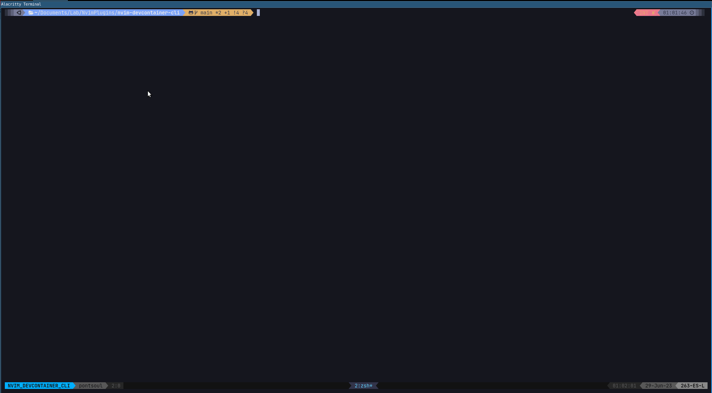

# Devcontainer CLI (Nvim Plugin)

Develop your next Repo in a Devcontainer using Nvim thanks to the [Devconatiner CLI](https://github.com/devcontainers/cli) and this plugin


As you can see in the GIF above, [alacritty](https://github.com/alacritty/alacritty) is being used as a Terminal Emulator. Any of the ones recommended [here](https://www.lazyvim.org/) would work. In case you are struggling configuring the nerd fonts, I personally recommend this great [youtube video](https://www.youtube.com/watch?v=mQdB_kHyZn8&t=182s).

---

First, which problem is this plugin trying to solve?

**Situation:**

Your favorite editor is **nvim** and you are currently developing a containerized application (using Docker).

**Problem:**

You can definitely use nvim for developing your code, but you quickly face problems with the [LSP](https://microsoft.github.io/language-server-protocol/) and the [DAP](https://microsoft.github.io/debug-adapter-protocol/) (among other plugins), because such plugins do not have access inside the Docker container. True, you can install **nvim** together with all your plugins inside the docker container extending the image. However, this can be cumbersome, and ultimately if you are working in a team, chances are you are the only one is using **nvim**. Also, you do not want to modify your own Docker Target inside your Dockerfile, installing **nvim** etc.

**Solution:**

There are multiple IDEs out there who give you the possibility to execute themself inside the Docker container you are developing, fixing the problems above, but there is nothing which works out-of-the-box for **nvim**. Recently, Microsoft opened the code used in VSCode for attaching the IDE to such containers ([Devconatiner CLI](https://github.com/devcontainers/cli)).

The current **nvim** plugin aims to take advantage of such CLI for creating your own local development environment on the top of your containerized applications. This plugin allows you use LSP capabilities for external modules (installed inside the Docker container), and also debug your application ([DAP](https://microsoft.github.io/debug-adapter-protocol/)).

But, what is happening under the hood?

1. First, devcontainer-cli is used for setting up your devcontainer, building the image based on the instructions defined in your [devcontainer.json](.devcontainer/devcontainer.json) and initializing a container based on such image.
1. Once the container is already running, nvim installed inside the Docker container together with a set of dependencies that can be found [here](https://github.com/arnaupv/nvim-devcontainer-cli/blob/main/bin/devcontainer_setup_scripts/root_setup.sh). This step resembles the installation of the [vscode-server](https://code.visualstudio.com/docs/devcontainers/containers) inside the container when using VSCode.
1. Finally, nvim needs certain configuration to work properly. That's why the following [dotfiles repo](https://github.com/arnaupv/dotfiles) is cloned inside the container ([here](https://github.com/arnaupv/nvim-devcontainer-cli/blob/main/bin/devcontainer_setup_scripts/none_root_setup.sh#L6)).
1. The last step is connecting inside the container. This could be done by `ssh` connection, but in this case the connection is done using `devcontainer exec` ([here](https://github.com/arnaupv/nvim-devcontainer-cli/blob/main/bin/connect_to_devcontainer.sh)).

As you can see what the plugin does is installing and configuring neovim inside the container, instead of communicating with the info inside the container via nvim client/server. One of the negative consequences of such approach is that all plugins need to be installed each time a devcontainer session starts. This is far from being efficient and it is something that needs to be improved in the future. However, I personally consider that the current solution is good enough for starting to work with nvim inside a Docker container.

**Inspiration:**

This plugin has been inspired by the work previously done by [esensar](https://github.com/esensar/nvim-dev-container) and by [jamestthompson3](https://github.com/jamestthompson3/nvim-remote-containers). The main different is that this plugin benefits from the [Devcontainer CLI](https://github.com/devcontainers/cli) which was opensourced by Microsoft in April 2022.

# Dependencies

- Only Ubuntu/Debian Docker Host (tested with Ubuntu 20.04 and 22.04) - [Planning to support other OS in the future](https://github.com/arnaupv/nvim-devcontainer-cli/issues/5).
- [docker](https://docs.docker.com/get-docker/)
- [devcontainer-cli](https://github.com/devcontainers/cli#npm-install)

# 🔧 Installation

- [lazy.nvim](https://github.com/folke/lazy.nvim)

```lua
{
  "arnaupv/nvim-devcontainer-cli",
  opts = {
    -- By default, if no extra config is added, following nvim_dotfiles are
    -- installed: "https://github.com/LazyVim/starter"
    -- This is an example for configuring other nvim_dotfiles inside the docker container
    nvim_dotfiles = "https://github.com/arnaupv/dotfiles.git",
    nvim_dotfiles_install = "cd ~/dotfiles/ && ./install.sh",
  },
  keys = {
    -- stylua: ignore
    {
      "<leader>cdu",
      ":DevcontainerUp<cr>",
      desc = "Up the DevContainer",
    },
    {
      "<leader>cdc",
      ":DevcontainerConnect<cr>",
      desc = "Connect to DevContainer",
    },
  }
},
```

The default_config can be found [here](./lua/devcontainer_cli/config/init.lua).

# How to use?

There are 2 commands: `:DevcontainerUp` and `:DevcontainerConnect`.

1. First you need to have your folder with the devcontainer instructions. This folder is usually called `.devcontainer` and contains a `devcontainer.json` file. This file is used by the [Devcontainer CLI](https://github.com/devcontainers/cli). As a first approach you can copy-paste the [.devcontainer](.devcontainer/devcontainer.json) folder of the current project and adapt it for your repo. You can also find more information about the `devcontainer.json` file [here](https://code.visualstudio.com/docs/remote/devcontainerjson-reference).

1. Then open a nvim session and execute the first command: `DevcontainerUp`, which will create the image based on your Dockerfile. Once created it will initialize a container with the previously created image, adding nvim and other tools defined in ./bin/devcontainer_setup_scripts/ . Currently the following [dotfiles](https://github.com/arnaupv/dotfiles) are hardcoded [here](./bin/devcontainer_setup_scripts/none_root_setup.sh). The new devcontainer running can be easily checked with the following command: `docker ps -a`.

1. If the process above finishes successfully, you are prepared for closing the current nvim session and open a new nvim inside the docker container. All this can be done from nvim itself, using the second command: `:DevcontainerConnect`.

1. As an example, you can try to create the first devcontainer using cloning the current repository, following the instructions above.

# Tests

Tests are executed automatically on each PR using Github Actions.

In case you want to run Github Actions locally, it is recommended to use [act](https://github.com/nektos/act#installation).
And then execute:

```bash
act -W .github/workflows/default.yml
```

Another option would be to connect to the devcontainer following the **How to use?** section.
Once connected to the devcontainer, execute:

```bash
make test
```

# FEATUREs (in order of priority)

1. [x] Capability to create and run a devcontainer using the [Devconatiner CLI](https://github.com/devcontainers/cli).
1. [x] Capability to attach in a running devcontainer
1. [x] The floating window created during the devcontainer Up process (:DevcontainerUp<cr>) is closed when the process finishes successfully.
1. [x] [Give the possibility of defining custom dotfiles when setting up the devcontainer](https://github.com/arnaupv/nvim-devcontainer-cli/issues/1)
1. [x] [Detect the cause/s of the UI issues of neovim when running inside the docker container.](https://github.com/arnaupv/nvim-devcontainer-cli/issues/15)
1. [ ] Add unit tests using plenary.busted lua module.
1. [ ] The logs printed in the floating window when preparing the Devcontainer are saved and easy to access.

1. [ ] Convert bash scripts in lua code.
1. [ ] Create .devcontainer/devcontainer.json template automatically via a nvim command. Add examples for when the devcontainer is created from docker and also from docker-compose.
